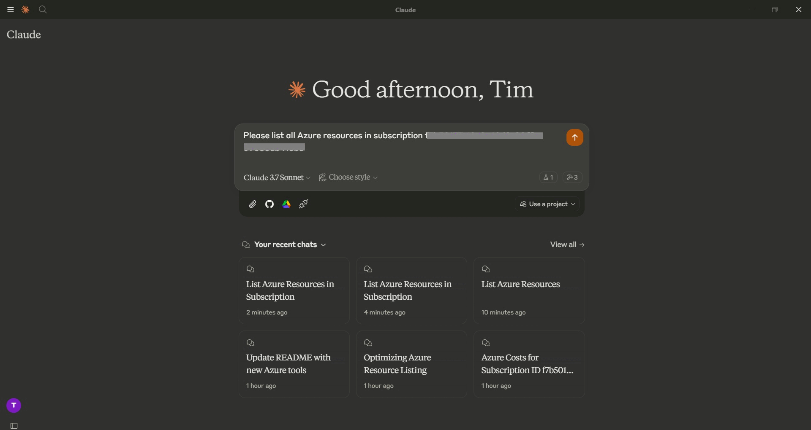
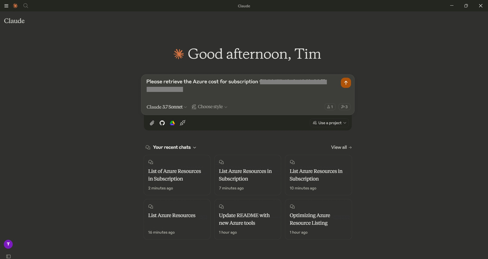

# Azure Resource MCP Server
This MCP server provides tools for listing and querying Azure resources directly from any MCP client, allowing you to efficiently browse your Azure infrastructure and analyze costs without leaving your workflow.

This is an example of how to query Azure resources:


This is an example of how to query Azure cost:


## Features

- 📊 **Resource Discovery** - List all resources across your Azure subscriptions
- 🔍 **Filtering** - Filter resources by resource group name
- 💰 **Cost Analysis** - Retrieve cost information for your Azure subscriptions
- 🔐 **Secure** - Uses your Azure service principal credentials
- 🏷️ **Detailed View** - See locations, types, and tags for all your resources

## Tools

- **list_azure_resources**
  - List Azure resource groups and resources using service principal authentication
  - Inputs:
    - `subscription_id` (string, optional): Specific subscription ID to query. If not provided, uses the default subscription from environment variables.
    - `resource_group_filter` (string, optional): Filter resource groups by name (case-insensitive contains match).
  - Returns: Formatted markdown list of resource groups and their resources with details such as location, type, and tags.

- **get_azure_costs_rest**
  - Get cost analysis data for an Azure subscription using the REST API
  - Inputs:
    - `subscription_id` (string, optional): Specific subscription ID to query. If not provided, uses the default subscription from environment variables.
    - `timeframe` (string, optional): Time period for cost analysis. Default is "MonthToDate".
  - Returns: Formatted markdown with cost analysis data, including daily costs and totals.

## Configuration

### Setting up Azure

1. Create an Azure service principal for authentication
2. Assign appropriate reader permissions to the service principal
3. Note your Azure subscription ID, tenant ID, client ID, and client secret
4. Set up the required environment variables

### Environment Variables

This server requires the following environment variables:

```bash
# Required Azure authentication
AZURE_TENANT_ID=your-tenant-id
AZURE_CLIENT_ID=your-client-id
AZURE_CLIENT_SECRET=your-client-secret
AZURE_SUBSCRIPTION_ID=your-subscription-id
```

## Installation

### Prerequisites

- Python 3.10+
- Azure subscription with appropriate permissions
- Service principal with reader access to resources

### Setup

If you prefer using uv:

```bash
# Setup environment with uv
uv venv
.venv\Scripts\activate  # On Windows
source .venv/bin/activate  # On macOS/Linux

# Install dependencies
uv add mcp[cli] azure-identity python-dotenv azure-mgmt-resource aiohttp

# Run server
uv run -m azure_resource_mcp_server
```

### Usage with Claude Desktop

To use with Claude Desktop, add the following to your configuration file:

```json
{
  "mcpServers": {
    "azure-resource": {
      "command": "uv",
      "args": [
        "--directory",
        "/ABSOLUTE/PATH/TO/PARENT/FOLDER",
        "run",
        "-m",
        "azure_resource_mcp_server"
      ],
      "env": {
        "AZURE_TENANT_ID": "your-tenant-id",
        "AZURE_CLIENT_ID": "your-client-id",
        "AZURE_CLIENT_SECRET": "your-client-secret",
        "AZURE_SUBSCRIPTION_ID": "your-subscription-id"
      }
    }
  }
}
```

### Example Usage

#### Listing Resources

To list all resources in the default subscription:

```
@azure-resource list_azure_resources
```

With resource group filtering:

```
@azure-resource list_azure_resources resource_group_filter=production
```

With specific subscription:

```
@azure-resource list_azure_resources subscription_id=00000000-0000-0000-0000-000000000000
```

#### Getting Cost Analysis

To get cost analysis for the current month:

```
@azure-resource get_azure_costs_rest
```

With specific subscription and timeframe:

```
@azure-resource get_azure_costs_rest subscription_id=00000000-0000-0000-0000-000000000000 timeframe=Custom
```
